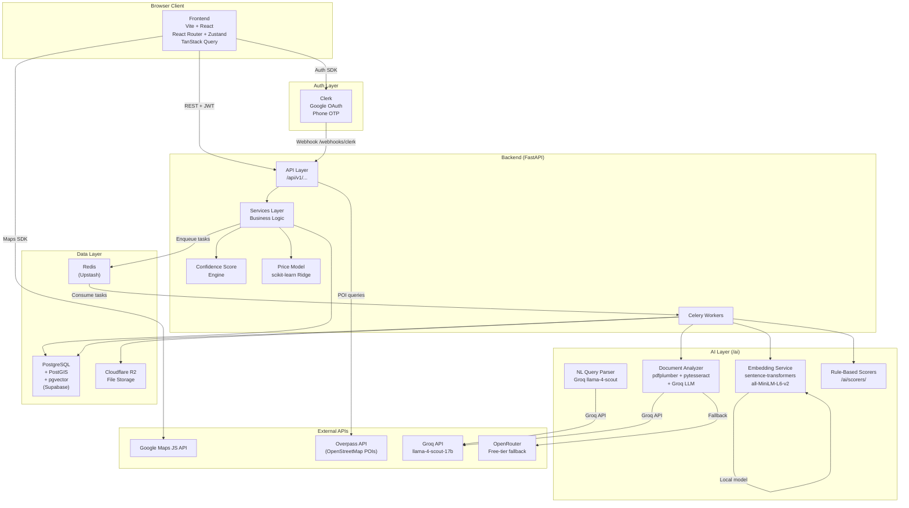
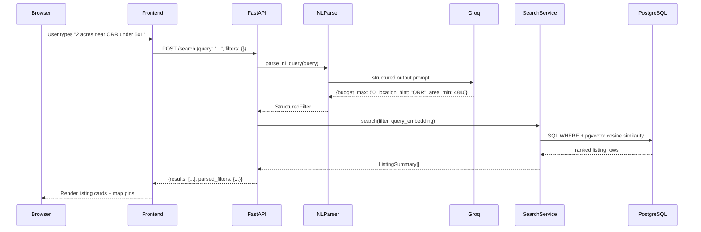
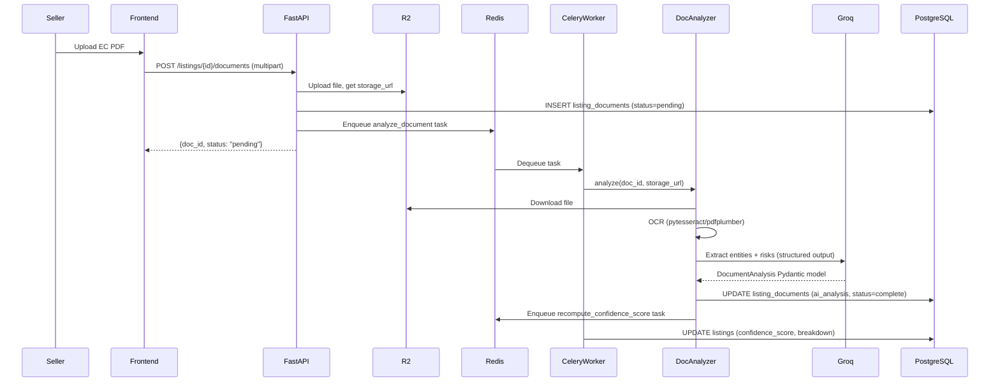
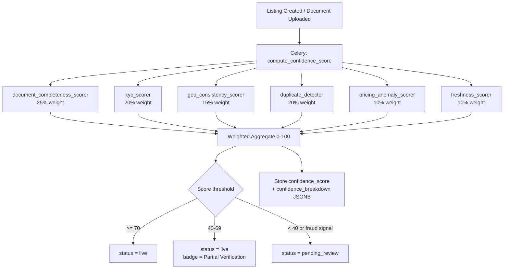

# Design Document: PlotIQ POC (Phases 0–3)

## Overview

PlotIQ is an AI-powered land discovery and verification platform targeting Hyderabad, Telangana. The POC covers Phases 0–3: Foundation, Core Discovery, Intelligence Layer, and Location & Geospatial Intelligence.

The platform differentiates from classifieds portals by layering intelligence on top of listings: fraud detection, legal document analysis, price estimation, location intelligence, and growth signal mapping. The primary user roles are Buyer/Investor, Seller/Owner, and Admin/Ops.

This design document covers the full system architecture for the monorepo, including the FastAPI backend, Vite + React frontend, AI pipeline, database schema, API contracts, and frontend component hierarchy.

---

## Architecture

### System Architecture Overview



### Monorepo Directory Structure

```
/
├── frontend/                    # Vite + React (moved from src/)
│   ├── public/
│   │   └── ce_f_f_c_be_d_b_d_ef_a_mp_.mp4   # Hero background video
│   ├── src/
│   │   ├── components/
│   │   │   ├── ui/              # Reusable primitives (GlassCard, DisclaimerBanner, etc.)
│   │   │   ├── map/             # Map-related components
│   │   │   ├── listing/         # Listing card, detail tabs
│   │   │   ├── search/          # Search bar, filter panel
│   │   │   ├── admin/           # Admin dashboard components
│   │   │   └── seller/          # Seller listing creation form
│   │   ├── pages/               # Route-level page components
│   │   ├── stores/              # Zustand stores
│   │   ├── hooks/               # Custom React hooks (TanStack Query wrappers)
│   │   ├── lib/                 # API client, utils, constants
│   │   ├── types/               # TypeScript type definitions
│   │   ├── App.tsx
│   │   ├── main.tsx
│   │   └── index.css
│   ├── index.html
│   ├── vite.config.ts
│   ├── tsconfig.json
│   └── package.json
│
├── backend/                     # FastAPI Python service
│   ├── app/
│   │   ├── api/                 # Route handlers (FastAPI routers)
│   │   │   ├── listings.py
│   │   │   ├── search.py
│   │   │   ├── documents.py
│   │   │   ├── admin.py
│   │   │   └── webhooks.py
│   │   ├── models/              # SQLAlchemy ORM models
│   │   │   ├── listing.py
│   │   │   ├── document.py
│   │   │   ├── growth_signal.py
│   │   │   ├── fraud_signal.py
│   │   │   ├── comparable.py
│   │   │   ├── user.py
│   │   │   └── audit_log.py
│   │   ├── schemas/             # Pydantic v2 request/response schemas
│   │   │   ├── listing.py
│   │   │   ├── document.py
│   │   │   ├── search.py
│   │   │   └── admin.py
│   │   ├── services/            # Business logic
│   │   │   ├── listing_service.py
│   │   │   ├── search_service.py
│   │   │   ├── price_service.py
│   │   │   ├── poi_service.py
│   │   │   └── growth_service.py
│   │   ├── workers/             # Celery task definitions
│   │   │   ├── celery_app.py
│   │   │   ├── score_tasks.py
│   │   │   ├── document_tasks.py
│   │   │   └── embedding_tasks.py
│   │   ├── core/                # Config, auth middleware, dependencies
│   │   │   ├── config.py
│   │   │   ├── auth.py
│   │   │   └── database.py
│   │   └── main.py
│   ├── alembic/                 # Database migrations
│   │   ├── versions/
│   │   └── env.py
│   ├── tests/
│   ├── requirements.txt
│   └── alembic.ini
│
├── ai/                          # LangChain chains, MCP tools, scorers
│   ├── scorers/
│   │   ├── document_completeness.py
│   │   ├── kyc_scorer.py
│   │   ├── geo_consistency.py
│   │   ├── duplicate_detector.py
│   │   ├── pricing_anomaly.py
│   │   └── freshness_scorer.py
│   ├── chains/
│   │   ├── nl_query_parser.py   # Groq structured output chain
│   │   └── document_analyzer.py # OCR + LLM extraction chain
│   ├── embeddings/
│   │   └── embedding_service.py # sentence-transformers wrapper
│   ├── price_model/
│   │   ├── train.py             # Ridge regression training
│   │   └── model.joblib         # Serialized model (generated at startup)
│   └── mcp_server.py            # MCP tool definitions
│
├── seed/
│   ├── seed.py                  # Main seed script
│   ├── listings_data.py         # 50-80 Hyderabad plot records
│   ├── growth_signals_data.py   # 15+ infrastructure projects
│   └── SEED_DATA.md
│
├── .env.example
├── README.md
└── docker-compose.yml           # Local dev: postgres, redis
```

### Request Flow: Natural Language Search



### Request Flow: Document Analysis Pipeline



### Confidence Score Computation Flow



---

## Components and Interfaces

### Frontend Component Hierarchy

```
App (React Router root)
├── Navbar                          # Frosted glass nav, auth state, links
├── Routes
│   ├── / → LandingPage
│   │   ├── Hero                    # Video background, CTA buttons
│   │   ├── IntelligenceTiersSection
│   │   │   └── GlassCard (x4)
│   │   └── VerificationSection
│   │
│   ├── /discover → DiscoverPage
│   │   ├── SearchBar               # NL input + submit
│   │   ├── FilterPanel             # Collapsible: price, area, locality, use type, score
│   │   ├── SplitView
│   │   │   ├── MapView             # Google Maps, custom pins, "Search this area" btn
│   │   │   │   ├── ListingPin (per listing, color-coded)
│   │   │   │   └── SearchAreaButton
│   │   │   └── ListingCardPanel    # Scrollable card list, bottom sheet on mobile
│   │   │       ├── ListingCard (per result)
│   │   │       │   ├── PriceBadge
│   │   │       │   ├── ConfidenceScoreBadge
│   │   │       │   ├── RiskFlagPill (x2 max)
│   │   │       │   └── AnalyzeButton
│   │   │       └── SkeletonCard (loading state)
│   │   └── DisclaimerBanner (variant="score")
│   │
│   ├── /listings/:id → ListingDetailPage
│   │   ├── BreadcrumbNav           # Back to map (preserves map state)
│   │   ├── ListingHeader           # Title, locality, price, area, status badge
│   │   └── TabNav (7 tabs)
│   │       ├── OverviewTab
│   │       │   ├── PlotSummary
│   │       │   ├── OwnerInfoCard   # Verified/unverified badge
│   │       │   ├── ListingAgeBadge
│   │       │   └── ThumbnailMap
│   │       ├── AIScoreTab
│   │       │   ├── ConfidenceRadialChart  # Recharts RadialBarChart
│   │       │   ├── DimensionBreakdown (x6 dimensions)
│   │       │   └── DisclaimerBanner (variant="score")
│   │       ├── LegalDocsTab
│   │       │   ├── DocumentUploadTracker  # EC, Sale Deed, Layout Approval, etc.
│   │       │   ├── DocumentSummaryCard (per uploaded doc)
│   │       │   └── DisclaimerBanner (variant="document")
│   │       ├── PriceIntelligenceTab
│   │       │   ├── PriceRangeCard  # P10-P90 confidence interval
│   │       │   ├── ComparablesList
│   │       │   ├── PriceTrendChart # Recharts LineChart
│   │       │   ├── PricingFlagBadge # Overpriced / Underpriced / Fair
│   │       │   ├── NegotiationRangeCard
│   │       │   └── DisclaimerBanner (variant="price")
│   │       ├── LocationIntelligenceTab
│   │       │   ├── MapView (satellite/hybrid toggle)
│   │       │   ├── POIOverlayControls  # Checkbox panel per category
│   │       │   ├── POIMarkers (per category)
│   │       │   ├── DistanceSummaryTable
│   │       │   └── FloodRiskOverlay    # Static GeoJSON layer
│   │       ├── FutureGrowthTab
│   │       │   ├── GrowthTierBadge     # High Growth / Emerging / Speculative
│   │       │   ├── GrowthSignalCard (per signal)
│   │       │   └── DisclaimerBanner (variant="growth")
│   │       └── RiskSummaryTab
│   │           ├── RiskFlagCard (top 3, with severity)
│   │           ├── MissingDocChecklist
│   │           └── FraudSignalReport
│   │
│   ├── /sell → SellerPage
│   │   └── MultiStepForm
│   │       ├── Step1LocationPicker  # Pin drop on map
│   │       ├── Step2PlotDetails     # Size, price, use type, ownership
│   │       └── Step3DocumentUpload  # EC, Sale Deed, photos
│   │
│   ├── /admin → AdminPage (Admin role only)
│   │   ├── MetricsPanel
│   │   │   ├── TotalListingsCard
│   │   │   ├── VerificationRateCard
│   │   │   ├── FraudCatchRateCard
│   │   │   └── StaleListingsCard
│   │   └── VerificationQueue
│   │       └── AdminListingRow (per pending listing)
│   │           └── ActionButtons (Approve / Request Docs / Reject / Mark Scam)
│   │
│   └── /legal → LegalPage
│       ├── TermsOfService
│       ├── PrivacyPolicy
│       ├── DisclaimerInventory
│       └── GrievanceContact
│
└── AuthModal (Clerk-powered, overlay)
    ├── GoogleOAuthButton
    └── PhoneOTPForm
```

### Zustand Store Shape

```typescript
// stores/mapStore.ts
interface MapStore {
  bounds: google.maps.LatLngBoundsLiteral | null;
  center: { lat: number; lng: number };
  zoom: number;
  activeFilters: SearchFilters;
  searchQuery: string;
  selectedListingId: string | null;
  comparisonTray: string[];           // listing IDs
  setBounds: (bounds: google.maps.LatLngBoundsLiteral) => void;
  setCenter: (center: { lat: number; lng: number }) => void;
  setZoom: (zoom: number) => void;
  setFilters: (filters: Partial<SearchFilters>) => void;
  setSearchQuery: (query: string) => void;
  selectListing: (id: string | null) => void;
  addToComparison: (id: string) => void;
  removeFromComparison: (id: string) => void;
}

// stores/authStore.ts
interface AuthStore {
  user: ClerkUser | null;
  isAdmin: boolean;
  setUser: (user: ClerkUser | null) => void;
}
```

### TanStack Query Hook Patterns

```typescript
// hooks/useSearch.ts
export function useSearch(query: string, filters: SearchFilters) {
  return useQuery({
    queryKey: ['search', query, filters],
    queryFn: () => api.post('/search', { query, filters }),
    staleTime: 30_000,
    enabled: query.length > 0 || hasActiveFilters(filters),
  });
}

// hooks/useListing.ts
export function useListing(id: string) {
  return useQuery({
    queryKey: ['listing', id],
    queryFn: () => api.get(`/listings/${id}`),
    staleTime: 60_000,
  });
}

// hooks/useListingScore.ts
export function useListingScore(id: string) {
  return useQuery({
    queryKey: ['listing', id, 'score'],
    queryFn: () => api.get(`/listings/${id}/score`),
  });
}
```

### DisclaimerBanner Component Interface

```typescript
// components/ui/DisclaimerBanner.tsx
interface DisclaimerBannerProps {
  variant: 'score' | 'price' | 'document' | 'growth';
}

const DISCLAIMER_TEXT: Record<DisclaimerBannerProps['variant'], string> = {
  score: "AI confidence score is a model estimate and does not constitute legal title certification.",
  price: "Price estimates are model outputs and are not a valuation or guarantee.",
  document: "This is an AI-generated summary only. Consult a licensed lawyer for legal advice and title verification.",
  growth: "Growth signals are based on announced or approved projects. Outcomes depend on execution. This is not investment advice.",
};
```

### Backend Service Interfaces

```python
# services/search_service.py
class SearchService:
    async def search(
        self,
        query: str,
        filters: SearchFilters | None,
        bounds: BoundingBox | None,
    ) -> SearchResult:
        """
        1. Parse NL query via NLQueryParser (Groq)
        2. Generate query embedding via EmbeddingService
        3. Build SQL: WHERE clauses from structured filters + PostGIS bounds
        4. Execute pgvector cosine similarity re-ranking
        5. Return ranked ListingSummary list + parsed_filters
        """

# services/price_service.py
class PriceService:
    def estimate(self, listing_id: str) -> PriceEstimate:
        """Returns P10/P50/P90 confidence interval in lakhs."""

    def get_comparables(self, listing_id: str) -> list[Comparable]:
        """PostGIS radius query, 20% area tolerance, 5-10 results."""

    def get_price_trend(self, locality: str) -> list[PriceTrendPoint]:
        """Median price/sqyd by month for the locality."""

# services/poi_service.py
class POIService:
    async def get_pois(self, lat: float, lng: float) -> POIResult:
        """Overpass API query, 5km radius, categorized + distances."""
```

---

## Data Models

### PostgreSQL Schema (SQLAlchemy / Alembic)

#### listings

| Column | Type | Notes |
|---|---|---|
| id | UUID PK | gen_random_uuid() |
| seller_id | UUID FK → users.id | nullable for seeded data |
| title | TEXT NOT NULL | |
| description | TEXT | |
| lat | DOUBLE PRECISION NOT NULL | |
| lng | DOUBLE PRECISION NOT NULL | |
| location | GEOGRAPHY(POINT, 4326) | PostGIS, generated from lat/lng |
| locality | VARCHAR(100) NOT NULL | e.g. "Kokapet" |
| price_lakhs | NUMERIC(10,2) NOT NULL | |
| area_sqyd | NUMERIC(10,2) NOT NULL | |
| price_per_sqyd | NUMERIC(10,2) GENERATED | price_lakhs * 100000 / area_sqyd |
| use_type | VARCHAR(50) | residential / commercial / agricultural |
| road_access | VARCHAR(50) | 40ft / 60ft / 100ft / highway |
| ownership_type | VARCHAR(50) | individual / joint / company |
| listing_status | VARCHAR(30) DEFAULT 'pending_review' | live / pending_review / removed |
| verification_tier | VARCHAR(30) | full / partial / unverified |
| confidence_score | SMALLINT | 0-100, nullable until computed |
| confidence_breakdown | JSONB | per-dimension scores |
| risk_flags | JSONB DEFAULT '[]' | array of RiskFlag objects |
| growth_signals | JSONB DEFAULT '[]' | cached nearby signal summaries |
| last_confirmed_at | TIMESTAMPTZ | for stale detection |
| created_at | TIMESTAMPTZ DEFAULT now() | |
| updated_at | TIMESTAMPTZ DEFAULT now() | |
| embedding | VECTOR(384) | all-MiniLM-L6-v2 produces 384-dim |

> **Note on embedding dimension**: The requirements mention VECTOR(1536) (OpenAI-sized), but the confirmed embedding model is `all-MiniLM-L6-v2` which produces 384-dimensional vectors. The schema uses VECTOR(384). If a larger model is substituted later, a migration will update this.

#### listing_documents

| Column | Type | Notes |
|---|---|---|
| id | UUID PK | |
| listing_id | UUID FK → listings.id ON DELETE CASCADE | |
| doc_type | VARCHAR(50) | ec / sale_deed / layout_approval / mutation_register / patta / photo |
| storage_url | TEXT NOT NULL | Cloudflare R2 URL |
| ocr_text | TEXT | extracted text |
| ai_analysis | JSONB | DocumentAnalysis Pydantic output |
| analysis_status | VARCHAR(30) DEFAULT 'pending' | pending / processing / complete / failed |
| failure_reason | TEXT | populated on failed status |
| uploaded_at | TIMESTAMPTZ DEFAULT now() | |

#### growth_signals

| Column | Type | Notes |
|---|---|---|
| id | UUID PK | |
| signal_type | VARCHAR(50) | hmda_layout / nhai_highway / metro / industrial_park |
| title | TEXT NOT NULL | |
| source_url | TEXT | required if status = announced |
| source_type | VARCHAR(50) | government / news / official |
| status | VARCHAR(30) | announced / approved / under_construction / operational |
| announced_date | DATE | |
| location | GEOGRAPHY(POLYGON, 4326) | PostGIS polygon |
| confidence | NUMERIC(3,2) | 0.00 - 1.00 |
| created_at | TIMESTAMPTZ DEFAULT now() | |

#### fraud_signals

| Column | Type | Notes |
|---|---|---|
| id | UUID PK | |
| listing_id | UUID FK → listings.id | |
| signal_type | VARCHAR(50) | duplicate_image / phone_reuse / price_anomaly / stale |
| severity | VARCHAR(20) | high / medium / low |
| detail | TEXT | human-readable explanation |
| status | VARCHAR(20) DEFAULT 'active' | active / resolved / dismissed |
| created_at | TIMESTAMPTZ DEFAULT now() | |

#### comparables

| Column | Type | Notes |
|---|---|---|
| id | UUID PK | |
| lat | DOUBLE PRECISION | |
| lng | DOUBLE PRECISION | |
| locality | VARCHAR(100) | |
| area_sqyd | NUMERIC(10,2) | |
| price_lakhs | NUMERIC(10,2) | |
| transaction_date | DATE | |
| source | VARCHAR(50) | seed / igrs / manual |

#### users

| Column | Type | Notes |
|---|---|---|
| id | UUID PK | |
| clerk_user_id | VARCHAR(100) UNIQUE NOT NULL | Clerk's user ID |
| phone | VARCHAR(20) | |
| email | VARCHAR(255) | |
| display_name | VARCHAR(255) | |
| role | VARCHAR(20) DEFAULT 'buyer' | buyer / seller / admin |
| kyc_status | VARCHAR(20) DEFAULT 'none' | none / pending / verified |
| created_at | TIMESTAMPTZ DEFAULT now() | |

#### audit_log

| Column | Type | Notes |
|---|---|---|
| id | UUID PK | |
| user_id | UUID FK → users.id | nullable for system actions |
| action_type | VARCHAR(50) | document_access / listing_create / admin_approve / etc. |
| target_type | VARCHAR(50) | listing / document / user |
| target_id | UUID | |
| metadata | JSONB | additional context |
| created_at | TIMESTAMPTZ DEFAULT now() | |

### Pydantic v2 Schemas (Key Shapes)

```python
# schemas/listing.py
class ListingCreate(BaseModel):
    title: str
    description: str | None = None
    lat: float = Field(ge=-90, le=90)
    lng: float = Field(ge=-180, le=180)
    locality: str
    price_lakhs: Decimal = Field(gt=0)
    area_sqyd: Decimal = Field(gt=0)
    use_type: Literal["residential", "commercial", "agricultural"]
    road_access: Literal["40ft", "60ft", "100ft", "highway", "none"]
    ownership_type: Literal["individual", "joint", "company"]
    tos_accepted: bool  # must be True, else HTTP 400

class ListingSummary(BaseModel):
    id: UUID
    title: str
    locality: str
    price_lakhs: Decimal
    area_sqyd: Decimal
    price_per_sqyd: Decimal
    confidence_score: int | None
    risk_flags: list[RiskFlag]
    listing_status: str
    lat: float
    lng: float

class ListingDetail(ListingSummary):
    description: str | None
    use_type: str
    road_access: str
    ownership_type: str
    verification_tier: str
    confidence_breakdown: dict | None
    growth_signals: list[GrowthSignalSummary]
    created_at: datetime
    last_confirmed_at: datetime | None

# schemas/search.py
class SearchFilters(BaseModel):
    budget_min: Decimal | None = None
    budget_max: Decimal | None = None
    location_hint: str | None = None
    use_type: str | None = None
    road_access: str | None = None
    area_min: Decimal | None = None
    area_max: Decimal | None = None
    confidence_min: int | None = Field(None, ge=0, le=100)
    localities: list[str] = []
    bounds: BoundingBox | None = None

class SearchRequest(BaseModel):
    query: str = ""
    filters: SearchFilters = SearchFilters()

class SearchResponse(BaseModel):
    results: list[ListingSummary]
    parsed_filters: SearchFilters
    total: int
    query_time_ms: float

# schemas/document.py
class DocumentAnalysis(BaseModel):
    doc_type: Literal["ec", "sale_deed", "layout_approval", "mutation_register", "patta"]
    named_parties: list[str]
    survey_numbers: list[str]
    dates: list[str]
    transaction_amounts: list[str]
    risk_clauses: list[str]
    missing_approvals: list[str]
    suspicious_patterns: list[str]
    summary: str
    confidence: float = Field(ge=0.0, le=1.0)
```

### Confidence Score Breakdown Shape

```python
class ConfidenceBreakdown(BaseModel):
    document_completeness: int    # 0-100, weight 25%
    owner_kyc: int                # 0-100, weight 20%
    geo_consistency: int          # 0-100, weight 15%
    duplicate_detection: int      # 0-100, weight 20%
    pricing_anomaly: int          # 0-100, weight 10%
    listing_freshness: int        # 0-100, weight 10%
    aggregate: int                # weighted sum 0-100
```

---

## Correctness Properties

*A property is a characteristic or behavior that should hold true across all valid executions of a system — essentially, a formal statement about what the system should do. Properties serve as the bridge between human-readable specifications and machine-verifiable correctness guarantees.*

**Property Reflection:** After reviewing all prework items, the following consolidations apply:
- 16.3 (Listing round-trip) and 16.5 (DocumentAnalysis round-trip) and 16.7 (SearchFilters round-trip) are three distinct round-trip properties on different types — all kept, no redundancy.
- 16.8 (validation error on bad input) is a distinct error-condition property — kept.
- 8.1 (score in [0,100]) is a range invariant — kept.
- 8.7 (pricing anomaly Z-score flagging) and 11.5 (overpriced/underpriced P25/P75 classification) are both price classification properties but test different functions (anomaly scorer vs. comparable classifier) — kept separately.
- 11.6 (negotiation range formula) is a mathematical invariant — kept.
- 6.3 (embedding dimension) is a structural invariant on the embedding service output — kept.
- 13.4 (growth tier label) is a pure classification property — kept.
- 14.3 (listing status from score threshold) is a pure classification property — kept.
- 14.3 and 8.1 are related but test different things: 8.1 tests the score is in range, 14.3 tests the status assignment from that score. Both kept.

### Property 1: Listing Serialization Round-Trip

*For any* valid `ListingCreate` payload (with any combination of valid field values, boundary decimals, and optional fields), deserializing the JSON dict to a Pydantic model, serializing back to JSON, then deserializing again SHALL produce a model instance equivalent to the first deserialization.

**Validates: Requirements 16.3**

### Property 2: DocumentAnalysis Serialization Round-Trip

*For any* valid `DocumentAnalysis` Pydantic model instance (with any `doc_type`, any combination of populated or empty string lists, and any confidence value in [0.0, 1.0]), serializing to JSON then deserializing from JSON SHALL produce a model instance equal to the original.

**Validates: Requirements 16.5**

### Property 3: SearchFilters Serialization Round-Trip

*For any* valid `SearchFilters` instance (with any combination of None and populated optional fields, any localities list, any bounds, any decimal budget values), serializing to a URL-safe query string then deserializing SHALL produce a `SearchFilters` instance equal to the original.

**Validates: Requirements 16.7**

### Property 4: Validation Error Identifies Field and Type

*For any* `ListingCreate` JSON dict where one or more fields contain values of the wrong type (e.g., a string where a float is expected, a float outside the valid range), the Pydantic deserialization SHALL raise a `ValidationError` whose error list contains an entry identifying the offending field name and the nature of the type mismatch.

**Validates: Requirements 16.8**

### Property 5: Confidence Score Is Always In Range

*For any* valid listing state input to the `Confidence_Score_Engine` (any combination of document completeness, KYC status, geo data, duplicate signals, price data, and listing age), the computed aggregate `confidence_score` SHALL be an integer in the closed interval [0, 100].

**Validates: Requirements 8.1**

### Property 6: Pricing Anomaly Flagging Matches Z-Score Threshold

*For any* locality price distribution (set of price-per-sqyd values) and any subject listing price-per-sqyd, the `pricing_anomaly_scorer` SHALL flag the listing as anomalous if and only if the Z-score of the subject price relative to the locality median exceeds 2.0.

**Validates: Requirements 8.7**

### Property 7: Overpriced/Underpriced Classification Matches Percentile Thresholds

*For any* non-empty list of comparable listing prices-per-sqyd and any subject listing price-per-sqyd, the price classifier SHALL return "overpriced" if and only if the subject price exceeds the P75 of comparables, "underpriced" if and only if it falls below the P25, and "fair" otherwise.

**Validates: Requirements 11.5**

### Property 8: Negotiation Range Formula Invariant

*For any* non-empty list of comparable listing prices-per-sqyd and any positive subject area in square yards, the negotiation range SHALL equal `[P25(comparables) * area, P50(comparables) * area]` in lakhs (after unit conversion).

**Validates: Requirements 11.6**

### Property 9: Embedding Service Always Returns Correct Dimension

*For any* non-empty input string, the `EmbeddingService` using `all-MiniLM-L6-v2` SHALL return a list of exactly 384 floats.

**Validates: Requirements 6.3**

### Property 10: Growth Tier Label Matches Signal Count and Status Rules

*For any* list of `GrowthSignal` records within 10km of a listing, the growth tier assignment SHALL satisfy: "High Growth Corridor" if and only if the count of signals with status `approved` or `under_construction` is ≥ 3; "Emerging Zone" if and only if that count is 1 or 2; "Speculative" if and only if that count is 0 (regardless of `announced` signals present).

**Validates: Requirements 13.4**

### Property 11: Listing Status Assignment Matches Score Thresholds

*For any* integer confidence score in [0, 100] with no fraud signals present, the listing status assignment SHALL satisfy: `live` if and only if score ≥ 70; `live` with "Partial Verification" badge if and only if 40 ≤ score ≤ 69; `pending_review` if and only if score < 40. Additionally, *for any* score value, the presence of any fraud signal SHALL always result in `pending_review` regardless of score.

**Validates: Requirements 14.3**

---

## Error Handling

### Backend Error Response Shape

All backend errors return a consistent JSON envelope:

```json
{
  "error": {
    "code": "VALIDATION_ERROR",
    "message": "Human-readable description",
    "details": [
      { "field": "price_lakhs", "issue": "must be greater than 0" }
    ]
  }
}
```

### HTTP Status Code Conventions

| Scenario | Status | Notes |
|---|---|---|
| Unauthenticated request to protected route | 401 | With `WWW-Authenticate` header |
| Authenticated but insufficient role | 403 | |
| Resource not found | 404 | |
| Pydantic validation failure | 422 | FastAPI default, with field details |
| Rate limit exceeded | 429 | With `Retry-After` header |
| Backend dependency unavailable | 503 | JSON body names the dependency |
| Unhandled exception | 500 | Never expose stack traces in production |

### Dependency Failure Handling

```python
# core/health.py
async def check_dependencies() -> DependencyStatus:
    """
    Checks: PostgreSQL, Redis, R2 (optional ping).
    Returns structured status. Called at startup and by GET /health.
    On failure: logs error with dependency name, returns 503 with JSON body.
    """
```

### Celery Task Error Handling

- All Celery tasks use `autoretry_for=(Exception,)` with `max_retries=3` and exponential backoff.
- Document analysis failures update `listing_documents.analysis_status = 'failed'` and populate `failure_reason`.
- Score computation failures leave `confidence_score = NULL` and log the error; the listing remains in `pending_review`.
- Tasks are idempotent: re-running a completed task is safe (upsert semantics).

### Overpass API Timeout Handling

```python
# services/poi_service.py
async def get_pois(lat, lng) -> POIResult:
    try:
        result = await overpass_client.query(lat, lng, timeout=10)
        return POIResult(pois=result, error=None)
    except (TimeoutError, httpx.RequestError):
        cached = await cache.get_pois(lat, lng)
        return POIResult(pois=cached or [], error="overpass_unavailable")
```

### KYC Data Sanitization

All LLM prompt construction functions in `/ai/chains/` must pass through a `sanitize_for_llm()` function that strips Aadhaar and PAN fields before building any prompt string. This is enforced at the service layer, not the API layer.

```python
# ai/chains/document_analyzer.py
BLOCKED_FIELDS = {"aadhaar_number", "pan_number", "aadhaar", "pan"}

def sanitize_for_llm(data: dict) -> dict:
    return {k: v for k, v in data.items() if k.lower() not in BLOCKED_FIELDS}
```

### Frontend Error States

- All TanStack Query hooks expose `isError` and `error` states.
- API errors are displayed as inline error cards within the relevant tab, not full-page errors.
- Network failures on the map view show a toast notification; the last cached results remain visible.
- Document upload failures show a retry button with the failure reason from the API response.

---

## Testing Strategy

### Dual Testing Approach

The testing strategy combines unit/example-based tests for specific behaviors with property-based tests for universal correctness guarantees.

### Property-Based Testing

**Library**: [Hypothesis](https://hypothesis.readthedocs.io/) (Python) for all backend property tests.

**Configuration**: Each property test runs a minimum of 100 examples (`@settings(max_examples=100)`).

**Tag format**: Each property test is tagged with a comment:
`# Feature: plotiq-poc, Property {N}: {property_text}`

**Property test implementations** (one test per property):

```python
# tests/test_properties.py
from hypothesis import given, settings, strategies as st
from hypothesis.strategies import builds, floats, text, lists, decimals

# Feature: plotiq-poc, Property 1: Listing serialization round-trip
@given(listing_create_strategy())
@settings(max_examples=100)
def test_listing_serialization_roundtrip(payload: dict):
    model1 = ListingCreate.model_validate(payload)
    json_str = model1.model_dump_json()
    model2 = ListingCreate.model_validate_json(json_str)
    assert model1 == model2

# Feature: plotiq-poc, Property 2: DocumentAnalysis serialization round-trip
@given(document_analysis_strategy())
@settings(max_examples=100)
def test_document_analysis_roundtrip(analysis: DocumentAnalysis):
    json_str = analysis.model_dump_json()
    restored = DocumentAnalysis.model_validate_json(json_str)
    assert analysis == restored

# Feature: plotiq-poc, Property 3: SearchFilters serialization round-trip
@given(search_filters_strategy())
@settings(max_examples=100)
def test_search_filters_roundtrip(filters: SearchFilters):
    query_string = filters_to_query_string(filters)
    restored = filters_from_query_string(query_string)
    assert filters == restored

# Feature: plotiq-poc, Property 4: Validation error identifies field
@given(invalid_listing_payload_strategy())
@settings(max_examples=100)
def test_validation_error_identifies_field(payload: dict, bad_field: str):
    with pytest.raises(ValidationError) as exc_info:
        ListingCreate.model_validate(payload)
    error_fields = [e["loc"][0] for e in exc_info.value.errors()]
    assert bad_field in error_fields

# Feature: plotiq-poc, Property 5: Confidence score always in [0, 100]
@given(listing_state_strategy())
@settings(max_examples=100)
def test_confidence_score_in_range(listing_state: ListingState):
    score = compute_confidence_score(listing_state)
    assert 0 <= score <= 100

# Feature: plotiq-poc, Property 6: Pricing anomaly matches Z-score threshold
@given(price_distribution_strategy(), floats(min_value=0.01, max_value=10000))
@settings(max_examples=100)
def test_pricing_anomaly_matches_zscore(locality_prices, subject_price):
    z_score = compute_zscore(subject_price, locality_prices)
    is_flagged = pricing_anomaly_scorer(subject_price, locality_prices)
    assert is_flagged == (z_score > 2.0)

# Feature: plotiq-poc, Property 7: Overpriced/underpriced matches P25/P75
@given(comparable_prices_strategy(), floats(min_value=0.01, max_value=10000))
@settings(max_examples=100)
def test_price_classification_matches_percentiles(comparables, subject_price):
    p25 = np.percentile(comparables, 25)
    p75 = np.percentile(comparables, 75)
    classification = classify_price(subject_price, comparables)
    if subject_price > p75:
        assert classification == "overpriced"
    elif subject_price < p25:
        assert classification == "underpriced"
    else:
        assert classification == "fair"

# Feature: plotiq-poc, Property 8: Negotiation range formula invariant
@given(comparable_prices_strategy(), floats(min_value=1, max_value=10000))
@settings(max_examples=100)
def test_negotiation_range_formula(comparables, area_sqyd):
    p25 = np.percentile(comparables, 25)
    p50 = np.percentile(comparables, 50)
    low, high = compute_negotiation_range(comparables, area_sqyd)
    assert abs(low - p25 * area_sqyd / 100000) < 0.001
    assert abs(high - p50 * area_sqyd / 100000) < 0.001

# Feature: plotiq-poc, Property 9: Embedding always returns 384 dimensions
@given(text(min_size=1, max_size=2000))
@settings(max_examples=100)
def test_embedding_dimension(input_text: str):
    embedding = embedding_service.embed(input_text)
    assert len(embedding) == 384
    assert all(isinstance(v, float) for v in embedding)

# Feature: plotiq-poc, Property 10: Growth tier label matches signal rules
@given(growth_signals_strategy())
@settings(max_examples=100)
def test_growth_tier_label(signals: list[GrowthSignal]):
    active_count = sum(
        1 for s in signals
        if s.status in ("approved", "under_construction")
    )
    tier = assign_growth_tier(signals)
    if active_count >= 3:
        assert tier == "High Growth Corridor"
    elif active_count in (1, 2):
        assert tier == "Emerging Zone"
    else:
        assert tier == "Speculative"

# Feature: plotiq-poc, Property 11: Listing status matches score thresholds
@given(st.integers(min_value=0, max_value=100), st.booleans())
@settings(max_examples=100)
def test_listing_status_from_score(score: int, has_fraud_signal: bool):
    status = assign_listing_status(score, has_fraud_signal)
    if has_fraud_signal:
        assert status == "pending_review"
    elif score >= 70:
        assert status == "live"
    elif score >= 40:
        assert status == "live"  # with partial badge
    else:
        assert status == "pending_review"
```

### Unit Tests

Unit tests cover specific examples, edge cases, and integration points:

- **Serializer/deserializer**: Known-good and known-bad payloads for each Pydantic schema
- **Confidence score dimensions**: Each scorer tested with boundary inputs (0 docs, all docs, KYC verified, etc.)
- **Price model**: Verify Ridge regression predictions are within expected range on seed data
- **Document analyzer**: Mock Groq responses, verify Pydantic output shape for each doc type
- **NL query parser**: Representative NL queries mapped to expected structured filters
- **Admin actions**: Verify audit log entry is created for each admin action type
- **Rate limiting**: Verify 429 response after 5 listing creations in 24h
- **DisclaimerBanner**: Component test verifying correct text for each variant prop

### Integration Tests

Integration tests run against a test database (PostgreSQL with PostGIS + pgvector):

- **Spatial queries**: Radius search, bounding box, nearest-N against seed data
- **pgvector search**: Cosine similarity returns results in expected order
- **Celery tasks**: End-to-end document analysis and score computation with test fixtures
- **Auth middleware**: Protected routes return 401/403 for unauthenticated/unauthorized requests
- **Clerk webhook**: User sync creates/updates user record correctly
- **Overpass API**: Timeout handling returns cached/empty result without 5xx

### Frontend Tests

- **Component tests** (Vitest + React Testing Library): DisclaimerBanner, ListingCard, ConfidenceRadialChart, FilterPanel
- **Route tests**: Verify /admin redirects non-admin users
- **Map state preservation**: Verify breadcrumb navigation restores map center/zoom/filters
- **Skeleton states**: Verify loading skeletons render during data fetch

### Performance Benchmarks (not PBT)

- `POST /search` < 500ms against seed dataset (< 10 concurrent requests)
- `GET /listings/{id}` < 300ms
- Document analysis pipeline < 30s for files up to 5MB

---

## API Contracts

### Base URL

All endpoints are prefixed with `/api/v1` in production. The health endpoint is at the root.

### Authentication

Protected endpoints require a `Authorization: Bearer <clerk_jwt>` header. The FastAPI auth middleware validates the JWT against Clerk's JWKS endpoint.

---

### GET /health

**Auth**: None

**Response 200**:
```json
{
  "status": "ok",
  "version": "0.1.0",
  "dependencies": {
    "postgres": "ok",
    "redis": "ok",
    "storage": "ok"
  }
}
```

**Response 503** (dependency unavailable):
```json
{
  "status": "degraded",
  "dependencies": {
    "postgres": "ok",
    "redis": "unavailable",
    "storage": "ok"
  }
}
```

---

### POST /search

**Auth**: None (public)

**Request**:
```json
{
  "query": "2 acres near ORR under 50 lakhs residential",
  "filters": {
    "budget_max": 50,
    "localities": ["Kokapet", "Shadnagar"],
    "confidence_min": 60
  }
}
```

**Response 200**:
```json
{
  "results": [
    {
      "id": "uuid",
      "title": "...",
      "locality": "Kokapet",
      "price_lakhs": 45.0,
      "area_sqyd": 267,
      "price_per_sqyd": 16854.0,
      "confidence_score": 78,
      "risk_flags": [{"type": "stale", "severity": "low"}],
      "listing_status": "live",
      "lat": 17.3850,
      "lng": 78.3867
    }
  ],
  "parsed_filters": {
    "budget_max": 50,
    "location_hint": "ORR",
    "area_min": 4840,
    "use_type": "residential"
  },
  "total": 12,
  "query_time_ms": 187.4
}
```

---

### GET /listings

**Auth**: None

**Query params**: `page` (int, default 1), `page_size` (int, default 20, max 100), `locality` (string), `status` (string)

**Response 200**:
```json
{
  "items": [ /* ListingSummary[] */ ],
  "total": 67,
  "page": 1,
  "page_size": 20
}
```

---

### GET /listings/{id}

**Auth**: None

**Response 200**: `ListingDetail` schema (see Data Models section)

**Response 404**: `{"error": {"code": "NOT_FOUND", "message": "Listing not found"}}`

---

### POST /listings

**Auth**: Required (Seller or Admin role)

**Request**: `ListingCreate` schema + `tos_accepted: true`

**Response 201**:
```json
{
  "id": "uuid",
  "listing_status": "pending_review",
  "message": "Listing created. AI analysis in progress."
}
```

**Response 400**: TOS not accepted

**Response 429**: Rate limit exceeded (5 per 24h per seller)

---

### POST /listings/{id}/documents

**Auth**: Required (listing owner or Admin)

**Request**: `multipart/form-data` with `file` (PDF/JPG/PNG, max 20MB) and `doc_type` field

**Response 202**:
```json
{
  "doc_id": "uuid",
  "status": "pending",
  "message": "Document uploaded. Analysis queued."
}
```

**Response 413**: File too large

---

### GET /listings/{id}/documents

**Auth**: Required (listing owner or Admin) — access logged to audit_log

**Response 200**:
```json
{
  "documents": [
    {
      "id": "uuid",
      "doc_type": "ec",
      "analysis_status": "complete",
      "ai_analysis": { /* DocumentAnalysis */ },
      "uploaded_at": "2025-01-15T10:30:00Z"
    }
  ]
}
```

---

### GET /listings/{id}/score

**Auth**: None

**Response 200**:
```json
{
  "confidence_score": 78,
  "breakdown": {
    "document_completeness": 80,
    "owner_kyc": 60,
    "geo_consistency": 90,
    "duplicate_detection": 100,
    "pricing_anomaly": 70,
    "listing_freshness": 85,
    "aggregate": 78
  },
  "computed_at": "2025-01-15T10:35:00Z"
}
```

---

### GET /listings/{id}/price-estimate

**Auth**: None

**Response 200**:
```json
{
  "estimate": {
    "p10_lakhs": 38.5,
    "p50_lakhs": 44.0,
    "p90_lakhs": 51.2
  },
  "classification": "fair",
  "negotiation_range": {
    "low_lakhs": 39.0,
    "high_lakhs": 44.0
  },
  "comparables": [
    {
      "locality": "Kokapet",
      "area_sqyd": 250,
      "price_lakhs": 42.0,
      "price_per_sqyd": 16800,
      "distance_km": 1.2
    }
  ],
  "price_trend": [
    { "month": "2024-10", "median_price_per_sqyd": 15200 },
    { "month": "2024-11", "median_price_per_sqyd": 15800 },
    { "month": "2024-12", "median_price_per_sqyd": 16400 }
  ]
}
```

---

### GET /listings/{id}/pois

**Auth**: None

**Response 200**:
```json
{
  "pois": {
    "schools": [
      { "name": "Delhi Public School", "distance_km": 1.4, "lat": 17.39, "lng": 78.39 }
    ],
    "hospitals": [],
    "malls": [],
    "metro_stations": [],
    "highways": [],
    "bus_depots": []
  },
  "error": null
}
```

**Response 200** (Overpass unavailable):
```json
{ "pois": {}, "error": "overpass_unavailable" }
```

---

### GET /listings/{id}/growth-signals

**Auth**: None

**Response 200**:
```json
{
  "growth_tier": "Emerging Zone",
  "signals": [
    {
      "id": "uuid",
      "signal_type": "metro",
      "title": "HMRL Metro Phase 3 Extension",
      "source_url": "https://hmrl.co.in/...",
      "source_type": "government",
      "status": "approved",
      "announced_date": "2024-06-15",
      "confidence": 0.92
    }
  ]
}
```

---

### POST /listings/{id}/report

**Auth**: Required (any authenticated user)

**Request**:
```json
{
  "reason": "duplicate_listing",
  "description": "This listing appears identical to listing XYZ"
}
```

**Response 201**: `{"report_id": "uuid", "status": "received"}`

---

### GET /admin/queue

**Auth**: Required (Admin role only)

**Response 200**:
```json
{
  "queue": [
    {
      "listing_id": "uuid",
      "title": "...",
      "locality": "Shadnagar",
      "confidence_score": 32,
      "fraud_signals": [{"type": "duplicate_image", "severity": "high"}],
      "created_at": "2025-01-15T09:00:00Z"
    }
  ],
  "total": 8
}
```

---

### POST /admin/listings/{id}/action

**Auth**: Required (Admin role only)

**Request**:
```json
{
  "action": "approve",
  "note": "Documents verified manually"
}
```

Valid actions: `approve`, `request_docs`, `reject`, `mark_scam`

**Response 200**: `{"listing_id": "uuid", "new_status": "live", "action": "approve"}`

---

### GET /admin/metrics

**Auth**: Required (Admin role only)

**Response 200**:
```json
{
  "total_listings": 67,
  "live_listings": 52,
  "pending_review": 8,
  "verification_rate_pct": 77.6,
  "fraud_catch_rate_pct": 12.3,
  "stale_listings": 4
}
```

---

### POST /webhooks/clerk

**Auth**: Clerk webhook signature (SVIX header verification)

**Request**: Clerk user event payload (user.created, user.updated)

**Response 200**: `{"synced": true}`

---

## Frontend Routing and Page Design

### React Router Configuration

```tsx
// App.tsx
<BrowserRouter>
  <Navbar />
  <Routes>
    <Route path="/" element={<LandingPage />} />
    <Route path="/discover" element={<DiscoverPage />} />
    <Route path="/listings/:id" element={<ListingDetailPage />} />
    <Route path="/sell" element={
      <RequireAuth><SellerPage /></RequireAuth>
    } />
    <Route path="/admin" element={
      <RequireAdmin><AdminPage /></RequireAdmin>
    } />
    <Route path="/legal" element={<LegalPage />} />
    <Route path="*" element={<Navigate to="/" />} />
  </Routes>
</BrowserRouter>
```

### Map State Preservation

When navigating from `/discover` to `/listings/:id`, the current map state (center, zoom, active filters, search query) is persisted in the Zustand `mapStore`. The `ListingDetailPage` renders a `BreadcrumbNav` with a "← Back to map" link that navigates to `/discover` without resetting the store, restoring the exact previous view.

### Responsive Layout: Discover Page

```
Desktop (>768px):
┌─────────────────────────────────────────────────────┐
│ Navbar (frosted glass, fixed top)                   │
├──────────────────────────┬──────────────────────────┤
│                          │ SearchBar + FilterPanel  │
│   MapView (60% width)    ├──────────────────────────┤
│   Google Maps            │ ListingCardPanel (40%)   │
│   Custom color pins      │ Scrollable cards         │
│   "Search this area" btn │                          │
└──────────────────────────┴──────────────────────────┘

Mobile (≤768px):
┌─────────────────────────────────────────────────────┐
│ Navbar                                              │
├─────────────────────────────────────────────────────┤
│ SearchBar                                           │
├─────────────────────────────────────────────────────┤
│ MapView (full width, ~50vh)                         │
├─────────────────────────────────────────────────────┤
│ ListingCardPanel (bottom sheet, swipe up)           │
└─────────────────────────────────────────────────────┘
```

### Design System Tokens (from existing index.css)

| Token | Value | Usage |
|---|---|---|
| Background | `#000000` | Page background |
| Surface | `#131313` | Elevated surfaces |
| Surface container | `#1f1f1f` | Nested containers |
| Glass card | `bg-white/3 border-white/20 backdrop-blur-[20px]` | All cards |
| Glass nav | `bg-black/40 border-white/10 backdrop-blur-[10px]` | Navbar |
| Primary button | `bg-white text-black font-semibold` | CTAs |
| Secondary button | `bg-white/5 border-white/20 text-white backdrop-blur-md` | Secondary actions |
| Font | Inter 400/500/600/700 | All text |
| Confidence green | `text-green-400 bg-green-500/20 border-green-500/30` | Score ≥ 80 |
| Confidence yellow | `text-yellow-400 bg-yellow-500/20 border-yellow-500/30` | Score 50–79 |
| Confidence red | `text-red-400 bg-red-500/20 border-red-500/30` | Score < 50 |
| Confidence grey | `text-white/40 bg-white/5` | No score |

### Video Fix

The Hero component's `<source src>` must be updated from the CloudFront CDN URL to `/ce_f_f_c_be_d_b_d_ef_a_mp_.mp4`. The video file must be moved from the repo root to `frontend/public/ce_f_f_c_be_d_b_d_ef_a_mp_.mp4` during the monorepo restructure.

```tsx
// Before (Hero.tsx)
src="https://d8j0ntlcm91z4.cloudfront.net/..."

// After (Hero.tsx)
src="/ce_f_f_c_be_d_b_d_ef_a_mp_.mp4"
```

---

## AI Pipeline Design

### NL Query Parser

**Model**: `meta-llama/llama-4-scout-17b-16e-instruct` via Groq API

**Approach**: Structured output via Groq's JSON mode / function calling

```python
# ai/chains/nl_query_parser.py
SYSTEM_PROMPT = """
You are a real estate search filter extractor for Hyderabad, India.
Extract structured filters from natural language queries.
Return ONLY a JSON object with these optional fields:
- budget_min (number, in lakhs)
- budget_max (number, in lakhs)
- location_hint (string, locality or landmark name)
- use_type ("residential" | "commercial" | "agricultural")
- road_access ("40ft" | "60ft" | "100ft" | "highway")
- area_min (number, in square yards)
- area_max (number, in square yards)
If a field cannot be extracted, omit it entirely.
"""

async def parse_nl_query(query: str) -> SearchFilters:
    response = await groq_client.chat.completions.create(
        model="meta-llama/llama-4-scout-17b-16e-instruct",
        messages=[
            {"role": "system", "content": SYSTEM_PROMPT},
            {"role": "user", "content": query}
        ],
        response_format={"type": "json_object"},
        temperature=0,
    )
    raw = json.loads(response.choices[0].message.content)
    return SearchFilters.model_validate(raw)
```

**Fallback**: If Groq is unavailable or returns invalid JSON, the parser returns an empty `SearchFilters()` and the search falls back to pure semantic search.

### Document Analyzer

**OCR**: `pdfplumber` for text-layer PDFs, `pytesseract` for scanned images/PDFs

**LLM**: Groq `llama-4-scout-17b-16e-instruct` with structured output, OpenRouter free-tier as fallback

```python
# ai/chains/document_analyzer.py
DOC_TYPE_PROMPTS = {
    "ec": "Extract from this Encumbrance Certificate: named parties, survey numbers, transaction dates, amounts, encumbrances, and any risk clauses.",
    "sale_deed": "Extract from this Sale Deed: buyer/seller names, survey numbers, sale date, sale amount, property description, and any suspicious clauses.",
    # ... per doc type
}

async def analyze_document(
    doc_id: str,
    doc_type: str,
    text: str,
) -> DocumentAnalysis:
    sanitized_text = sanitize_for_llm({"text": text})["text"]
    prompt = DOC_TYPE_PROMPTS[doc_type]
    response = await groq_client.chat.completions.create(
        model="meta-llama/llama-4-scout-17b-16e-instruct",
        messages=[
            {"role": "system", "content": prompt},
            {"role": "user", "content": sanitized_text[:8000]}  # token budget
        ],
        response_format={"type": "json_object"},
    )
    raw = json.loads(response.choices[0].message.content)
    return DocumentAnalysis(doc_type=doc_type, **raw)
```

### Embedding Service

**Model**: `sentence-transformers/all-MiniLM-L6-v2` (384-dimensional, runs locally)

**Text input**: Concatenation of `title + locality + description + use_type + road_access`

```python
# ai/embeddings/embedding_service.py
from sentence_transformers import SentenceTransformer

class EmbeddingService:
    def __init__(self):
        self.model = SentenceTransformer("all-MiniLM-L6-v2")

    def embed(self, text: str) -> list[float]:
        return self.model.encode(text).tolist()

    def embed_listing(self, listing: Listing) -> list[float]:
        text = f"{listing.title} {listing.locality} {listing.description or ''} {listing.use_type} {listing.road_access}"
        return self.embed(text)
```

### Price Model

**Algorithm**: scikit-learn `Ridge` regression

**Features**: locality (one-hot encoded), area_sqyd, road_access (ordinal), distance_to_orr_km, distance_to_highway_km, use_type (one-hot), doc_completeness_score, listing_age_days

**Training**: Runs at backend startup if `model.joblib` does not exist; uses seed dataset

**Output**: P10/P50/P90 via bootstrap resampling (100 bootstrap samples)

```python
# ai/price_model/train.py
def train_price_model(listings: list[dict]) -> Pipeline:
    pipeline = Pipeline([
        ("preprocessor", ColumnTransformer([
            ("locality_ohe", OneHotEncoder(handle_unknown="ignore"), ["locality"]),
            ("use_type_ohe", OneHotEncoder(handle_unknown="ignore"), ["use_type"]),
            ("numeric", StandardScaler(), NUMERIC_FEATURES),
        ])),
        ("model", Ridge(alpha=1.0)),
    ])
    X = pd.DataFrame(listings)[FEATURE_COLUMNS]
    y = pd.DataFrame(listings)["price_per_sqyd"]
    pipeline.fit(X, y)
    joblib.dump(pipeline, "ai/price_model/model.joblib")
    return pipeline
```

### Confidence Score Engine

Each scorer is a pure Python function in `/ai/scorers/` returning a score in [0, 100]:

| Scorer | Weight | Logic |
|---|---|---|
| `document_completeness` | 25% | Points per doc type present: EC=30, Sale Deed=30, Layout Approval=20, Mutation=10, Patta=10 |
| `kyc_scorer` | 20% | 100 if KYC verified, 50 if pending, 0 if none |
| `geo_consistency` | 15% | Checks lat/lng is within Hyderabad bounding box; cross-checks locality name against reverse geocode |
| `duplicate_detector` | 20% | 0 if perceptual hash collision found; 0 if phone reuse > 3 localities; 100 otherwise |
| `pricing_anomaly` | 10% | 100 if Z-score ≤ 2; 50 if 2 < Z-score ≤ 3; 0 if Z-score > 3 |
| `freshness_scorer` | 10% | 100 if confirmed < 30 days ago; linear decay to 0 at 90 days |

```python
# ai/scorers/confidence_engine.py
WEIGHTS = {
    "document_completeness": 0.25,
    "owner_kyc": 0.20,
    "geo_consistency": 0.15,
    "duplicate_detection": 0.20,
    "pricing_anomaly": 0.10,
    "listing_freshness": 0.10,
}

def compute_confidence_score(listing_state: ListingState) -> tuple[int, ConfidenceBreakdown]:
    scores = {
        "document_completeness": document_completeness_scorer(listing_state),
        "owner_kyc": kyc_scorer(listing_state),
        "geo_consistency": geo_consistency_scorer(listing_state),
        "duplicate_detection": duplicate_detector(listing_state),
        "pricing_anomaly": pricing_anomaly_scorer(listing_state),
        "listing_freshness": freshness_scorer(listing_state),
    }
    aggregate = int(sum(scores[k] * WEIGHTS[k] for k in scores))
    return aggregate, ConfidenceBreakdown(aggregate=aggregate, **scores)
```

---

*Document version: 1.0 — PlotIQ POC Phases 0–3*
*Spec path: .kiro/specs/plotiq-poc/design.md*
